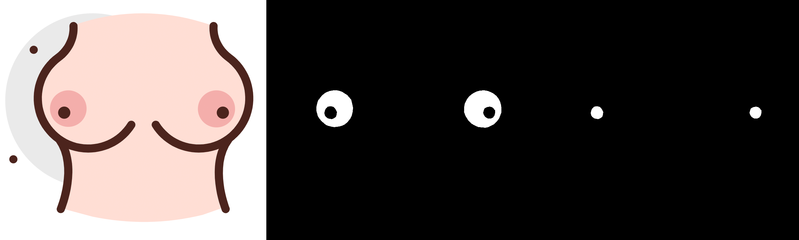
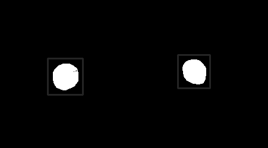

# Official DeepNipple Algorithm 

[](http://alfonsomedela.com/)

[](https://www.python.org/)
[](https://www.fast.ai/)
[](https://pytorch.org/)
[](https://opencv.org/)

**[DeepNipple](https://alfonsomedela.com/deepnipple-dataset/)** is an algorithm that detects the areola and nipple with very high precision. The core is a convolutional neural network that solves a typical AI segmentation problem. This novel dataset and algorithm are the state-of-the-art in nipple detection and can be used for real-world applications such as criminal identification.

I am sure that github's community can take the best from this repo, and inspire other creative tools.

## Table of contents
- [How does DeepNipple work?](#how-does-deepnipple-work)
- [Running DeepNipple](#running-deepnipple)
- [Performance](#performance)
- [Applications](#applications)
- [Previous work](#previous-work)
- [Contact](#contact)


# How does DeepNipple work?

**DeepNipple** innovates in nipple detection by rethinking the problem as a segmentation problem comprising of two categories: areola and nipple. It is also possible to extract the areola and nipple in a bounding box as if it was an object detection problem.

## [Dataset](https://alfonsomedela.com/deepnipple-dataset/)
**[DeepNipple](https://alfonsomedela.com/deepnipple-dataset/)** dataset is composed of 1,000 images of more than 200 subjects with their areola and nipple segmentation masks. The figure below shows an example of an image and its areola and nipple masks, which in the dataset come as a single mask with pixel value 0 for background, 1 for areola and 2 for nipple. The example is not an original image of the dataset to avoid problems with NSFW content.


 


Dataset access [here](https://alfonsomedela.com/deepnipple-dataset/).


### Other datasets
[*NTU-Nipple-v1*](https://github.com/matkowski-voy/The-Nipple-Areola-Complex-for-Criminal-Identification) dataset, used in [*The Nipple-Areola Complex for Criminal Identification*](https://arxiv.org/pdf/1905.11651.pdf), contains 2732 images from 428 different nipple-areola complexes (NAC) but they only provide a bounding box.

## Method

### Segmentation
The U-Net is convolutional network architecture for fast and precise segmentation of images. Up to now it has outperformed the prior best method (a sliding-window convolutional network) on the ISBI challenge for segmentation of neuronal structures in electron microscopic stacks. It is possible to use different base networks within a unet, like the different versions of ResNet.

### Seg2bbox
*Seg2bbox* consist in converting output mask pixel values into bounding boxes. This is done by applying a contour finder to obtain x1, x2, y1 and y2 points. The figure below shows a segmentation mask with the calculated bounding box for each blob.

 

# Running DeepNipple

Download PyTorch [weights](https://drive.google.com/file/d/1tG2ZiJ4vkzLpkPHOs84PVuXaX51ov_VZ/view?usp=sharing) for Resnet34 and place them in the directory *base-model*.

```
├── 📁 DeepNipple
│   |
│   ├── 📁 utils
│   │   ├── 📁 advanced-model
│   │   ├── 📁 base-model
│   |   |   ├── export.pkl
```

Then run the following command in the terminal:

```
$ python base_deepnipple.py --mode seg --img_path PATH --show True
```

# Performance
## Base algorithm 🔓
This algorithm is public. It has been trained only on 138 images, validated on 34 images and tested on 19 images so metrics are not supported by a proper size and diversified subset.

### Segmentation
<table class="tg">
<thead>
  <tr>
    <th class="tg-uzvj" rowspan="2">Model</th>
    <th class="tg-uzvj" rowspan="2">Categories</th>
    <th class="tg-7btt" colspan="3">Metrics</th>
  </tr>
  <tr>
    <th class="tg-7btt">Precision (%)</th>
    <th class="tg-7btt">Recall (%)<br></th>
    <th class="tg-7btt">F1 <span style="font-weight:700;font-style:normal">(%)</span><br></th>
  </tr>
</thead>
<tbody>
  <tr>
    <td class="tg-9wq8" rowspan="3">Resnet34</td>
    <td class="tg-0pky">Background</td>
    <td class="tg-0pky">99.36 &plusmn; 0.01</td>
    <td class="tg-0pky">99.84 &plusmn; 0.02</td>
    <td class="tg-0pky">99.59 &plusmn; 0.00</td>
  </tr>
  <tr>
    <td class="tg-0lax">Areola</td>
    <td class="tg-0lax">68.48 &plusmn; 26.14</td>
    <td class="tg-0lax">50.65 &plusmn; 31.20</td>
    <td class="tg-0lax">53.67 &plusmn; 27.98</td>
  </tr>
  <tr>
    <td class="tg-0lax">Nipple</td>
    <td class="tg-0lax">46.38 &plusmn; 34.45</td>
    <td class="tg-0lax">40.67 &plusmn; 35.00</td>
    <td class="tg-0lax">38.63 &plusmn; 29.60</td>
  </tr>
</tbody>
</table>

The model finds quite good the NAC but it varies a lot from image to image. It performs quite badly in images where the nipple is too far and covers only XXX a few pixels. Surprisingly, even if in those images segmentation is not that good, it finds something. As we see, standard deviation is very high, because some images get over 90% in some metrics while others get close to 0%. We find the following outputs:
- NAC is detected with success
- NAC is partially detected
- Not a single NAC pixel detected
- False positive  

### Detection

Detection has been reduced to the simple binary problem of finding if there is at least one nipple in the image. 

<table class="tg">
<thead>
  <tr>
    <th class="tg-7btt" rowspan="2">Model</th>
    <th class="tg-amwm" rowspan="2">Category</th>
    <th class="tg-7btt" colspan="2">Metrics</th>
  </tr>
  <tr>
    <th class="tg-7btt">Sensitivity (%)</th>
    <th class="tg-7btt">Specificity (%)</th>
  </tr>
</thead>
<tbody>
  <tr>
    <td class="tg-c3ow">Resnet34</td>
    <td class="tg-baqh">NAC</td>
    <td class="tg-c3ow"> 88.24 </td>
    <td class="tg-c3ow"> 85.00 </td>
  </tr>
</tbody>
</table>

## Advanced algorithm 🔒
This algorithm is trained on 70% of the data, validated on 20% and tested on 10%. Is is still to be tested. Results will be released soon.

### Segmentation

<table class="tg">
<thead>
  <tr>
    <th class="tg-uzvj" rowspan="2">Model</th>
    <th class="tg-uzvj" rowspan="2">Categories</th>
    <th class="tg-7btt" colspan="3">Metrics</th>
  </tr>
  <tr>
    <th class="tg-7btt">Precision (%)</th>
    <th class="tg-7btt">Recall (%)<br></th>
    <th class="tg-7btt">F1 <span style="font-weight:700;font-style:normal">(%)</span><br></th>
  </tr>
</thead>
<tbody>
  <tr>
    <td class="tg-9wq8" rowspan="3">Resnet34</td>
    <td class="tg-0pky">Background</td>
    <td style="text-align:center" class="tg-0pky">-</td>
    <td style="text-align:center" class="tg-0pky" >-</td>
    <td class="tg-0pky">-</td>
  </tr>
  <tr>
    <td class="tg-0pky">Areola</td>
    <td class="tg-0pky">-</td>
    <td class="tg-0pky">-</td>
    <td class="tg-0pky">-</td>
  </tr>
  <tr>
    <td class="tg-0pky">Nipple</td>
    <td class="tg-0pky">-</td>
    <td class="tg-0pky">-</td>
    <td class="tg-0pky">-</td>
  </tr>
  <tr>
    <td class="tg-0lax" rowspan="3">Resnet101</td>
    <td class="tg-0lax">Background</td>
    <td class="tg-0lax">-</td>
    <td class="tg-0lax">-</td>
    <td class="tg-0lax">-</td>
  </tr>
  <tr>
    <td class="tg-0lax">Areola</td>
    <td class="tg-0lax">-</td>
    <td class="tg-0lax">-</td>
    <td class="tg-0lax">-</td>
  </tr>
  <tr>
    <td class="tg-0lax">Nipple</td>
    <td class="tg-0lax">-</td>
    <td class="tg-0lax">-</td>
    <td class="tg-0lax">-</td>
  </tr>
</tbody>
</table>

### Detection

<table class="tg">
<thead>
  <tr>
    <th class="tg-7btt" rowspan="2">Model</th>
    <th class="tg-amwm" rowspan="2">Category</th>
    <th class="tg-7btt" colspan="2">Metrics</th>
  </tr>
  <tr>
    <th class="tg-7btt">Sensitivity (%)</th>
    <th class="tg-7btt">Specificity (%)</th>
  </tr>
</thead>
<tbody>
  <tr>
    <td class="tg-c3ow">Resnet34</td>
    <td class="tg-baqh">NAC</td>
    <td class="tg-c3ow"> - </td>
    <td class="tg-c3ow"> - </td>
  </tr>
  <tr>
    <td class="tg-c3ow">Resnet101</td>
    <td class="tg-baqh">NAC</td>
    <td class="tg-c3ow"> - </td>
    <td class="tg-c3ow"> - </td>
  </tr>
</tbody>
</table>


# Applications

## DeepNippleID 💻
**DeepNippleID** is a nipple identification algorithm under development. Identifiying a person has many interesting applications like finding criminals and this is typically done by face recognition. However, sexual offenders do not normally show their face in the videos. Identifying people by finding similarity in the nipples could be useful. Wojciech et al. conclude that *"the experimental results indicate that the NAC can be a useful characteristic for forensic applications".*


## Nipple censor 🔒
This application uses nipple detection to find nipples and censor the images by applying blur, emoji or other type of modification.

## Obscene content idetification 🔒
This application uses nipple detection to find nipples in videos or a large batch of images and finds NSFW content. It can be used as a filtering tool.


# Previous work
There is not much research on this area. I will list some of the papers I found:

- [*The Nipple-Areola Complex for Criminal Identification*](https://arxiv.org/pdf/1905.11651.pdf) (2019)
- [*Nipple detection to identify negative content on digital images*](https://ieeexplore.ieee.org/abstract/document/7828631) (2016)
- [*Automatic Nipple Detection based on Face Detection and Ideal Proportion Female using Random Forest*](https://ieeexplore.ieee.org/abstract/document/6865772) (2013)
- [*Automatic Nipple Detection Using Cascaded AdaBoost Classifier*](https://ieeexplore.ieee.org/abstract/document/6406030) (2012)
- [*Automatic Nipple Detection Using Shape and Statistical Skin Color Information*](https://www.improbable.com/2013/02/08/towards-a-robust-nipple-detector/) (2010)
- [*Nipple Detection for Obscene Pictures*](http://www.wseas.us/e-library/conferences/2005corfu/c1/papers/498-162.pdf) (2005)

There is an [Android App](https://www.reddit.com/r/computervision/comments/33n3st/nippler_android_app_for_nipple_detection_with/) that apparently uses object detection to locate nipples.

# Donations ₿
**BTC Wallet**: 1DswCAGmXYQ4u2EWVJWitySM7Xo7SH4Wdf


# Contact
[✉️](alfonmedela@gmail.com)  |
[🔗](https://www.linkedin.com/in/alfonsomedela/) |
[🕸](http://alfonsomedela.com/)


